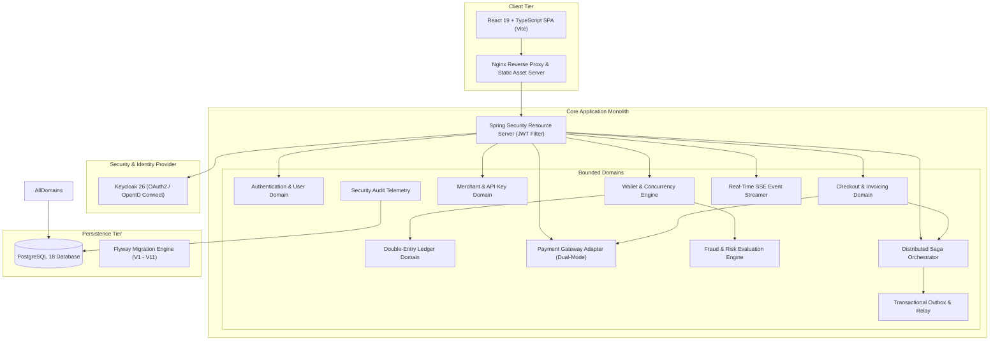
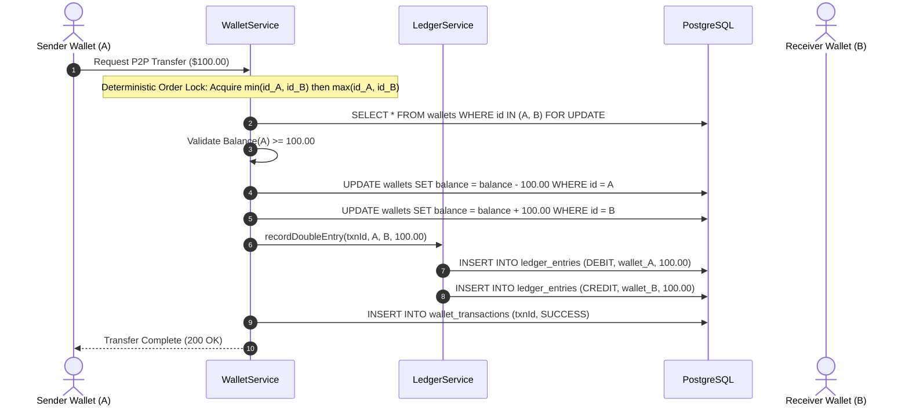
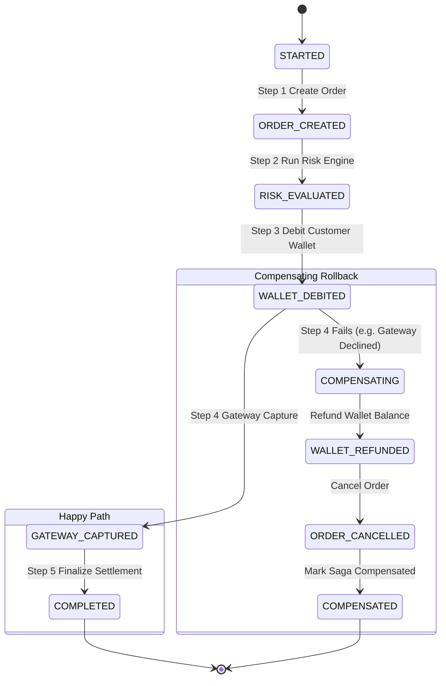
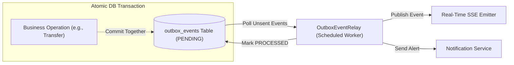

# SecurePay — Architecture & System Design Specification

SecurePay is a production-inspired, event-driven digital payment and wallet platform built as an engineering-driven college major project. It simulates modern fintech architectures like Stripe, Razorpay, and PayPal, balancing enterprise engineering rigor with clear, modular maintainability.

---

## 1. High-Level System Architecture

SecurePay implements a **Domain-Oriented Modular Monolith** designed for clear bounded contexts, transactional integrity, and evolution toward distributed microservices.



---

## 2. Bounded Contexts & Domain Organization

The backend is strictly divided into cohesive domain modules located under `com.securepay`:

| Domain Package | Primary Responsibility | Key Entities & Components |
| :--- | :--- | :--- |
| `com.securepay.user` | User lifecycle, registration, KYC status management | `User`, `KycStatus`, `UserService`, `UserController` |
| `com.securepay.auth` | Security configuration, Keycloak JWT converter, RBAC | `SecurityConfig`, `KeycloakJwtAuthenticationConverter` |
| `com.securepay.wallet` | Customer wallets, peer-to-peer transfers, deadlock prevention | `Wallet`, `WalletTransaction`, `WalletService`, `BeneficiaryService` |
| `com.securepay.ledger` | Immutable financial journal, debit/credit invariant tracking | `LedgerEntry`, `LedgerEntryType`, `LedgerService` |
| `com.securepay.merchant` | Merchant registration, SHA-256 hashed API key management | `Merchant`, `MerchantApiKey`, `MerchantService` |
| `com.securepay.payment` | Merchant order creation, checkout flows, refund processing | `PaymentOrder`, `PaymentRefund`, `PaymentService` |
| `com.securepay.gateway` | External payment gateway abstraction (Simulated + Razorpay) | `PaymentGatewayAdapter`, `SimulatedPaymentGatewayAdapter`, `WebhookService` |
| `com.securepay.outbox` | Guaranteed at-least-once asynchronous event publishing | `OutboxEvent`, `OutboxService`, `OutboxEventRelay` |
| `com.securepay.saga` | Multi-step transaction orchestration & compensating rollback | `PaymentSagaInstance`, `PaymentSagaOrchestrator`, `SagaStep` |
| `com.securepay.risk` | Real-time fraud detection & velocity risk evaluation | `RiskEngineService`, `RiskAssessment`, `RiskLevel` |
| `com.securepay.audit` | Non-repudiation audit logging for compliance | `SecurityAuditLog`, `SecurityAuditService` |
| `com.securepay.notification`| Customer alerts (EMAIL, SMS, PUSH, IN_APP) | `Notification`, `NotificationService` |
| `com.securepay.realtime` | Server-Sent Events (SSE) for balance updates & alerts | `RealtimeEventService`, `RealtimeEventController` |

---

## 3. Double-Entry Ledger Architecture

Financial correctness is guaranteed through an **immutable double-entry bookkeeping ledger** modeled after banking core systems.

### Invariants:
1. **Conservation of Balance:** For every transfer, the sum of debits MUST equal the sum of credits:
   $$\sum \text{Debits} = \sum \text{Credits}$$
2. **Immutability:** Ledger entries are strictly **insert-only**. No `UPDATE` or `DELETE` statements are ever permitted on the `ledger_entries` table. Corrections are recorded as compensating offsetting entries.
3. **Traceability:** Every ledger record contains the transaction ID, source wallet ID, target wallet ID, entry type (`DEBIT` or `CREDIT`), amount, and timestamp.



---

## 4. Concurrency Control & Deadlock Prevention

### The Concurrency Problem
If Customer A sends money to Customer B while Customer B simultaneously sends money to Customer A:
- Thread 1 locks Wallet A and requests a lock on Wallet B.
- Thread 2 locks Wallet B and requests a lock on Wallet A.
- **Result:** Classic circular wait deadlock ($A \to B \to A$) causing database transaction rollback.

### SecurePay's Deterministic Ordering Solution
SecurePay eliminates circular wait conditions by acquiring pessimistic write locks in a strict numerical sequence based on wallet IDs:

```java
Long firstLockId = Math.min(senderWallet.getId(), receiverWallet.getId());
Long secondLockId = Math.max(senderWallet.getId(), receiverWallet.getId());

Wallet firstWallet = walletRepository.findByIdForUpdate(firstLockId)
    .orElseThrow(...);
Wallet secondWallet = walletRepository.findByIdForUpdate(secondLockId)
    .orElseThrow(...);
```

Because all concurrent threads acquire locks in the exact same global ascending order, cyclic dependency graphs are mathematically impossible.

---

## 5. Distributed Saga Orchestration Pattern

For multi-stage transactions that span multiple bounded contexts or external systems (e.g., checkout order $\to$ wallet debit $\to$ payment gateway verification $\to$ merchant disbursement), SecurePay uses an **Orchestrated Saga Pattern** with automated compensating transactions.



### Compensation Workflow:
If any subsequent step fails (e.g., payment gateway rejection, fraud alert trigger):
1. The `PaymentSagaOrchestrator` catches the exception.
2. It transitions the saga instance to `COMPENSATING`.
3. It replays compensation steps in reverse order (e.g., re-crediting the debited wallet balance, updating the ledger with compensating entries).
4. Marks the saga state as `COMPENSATED`.

---

## 6. Transactional Outbox Pattern

To guarantee **at-least-once message delivery** without relying on distributed two-phase commits (2PC/XA), SecurePay implements the **Transactional Outbox Pattern**:



1. Business operations and their corresponding event payloads are committed **atomically in the same database transaction**.
2. If the application crashes before publishing, the event remains safely stored as `PENDING` in `outbox_events`.
3. The `OutboxEventRelay` background worker polls pending events, transmits them to downstream consumers (SSE emitters, notification pipelines), and marks them `PROCESSED`.

---

## 7. Security & Identity Architecture

### Keycloak OIDC Authentication Flow
1. The user authenticates against Keycloak using OpenID Connect Authorization Code Flow (or Direct Grant in dev).
2. Keycloak signs an RS256 JWT containing user identity and assigned realm/resource roles (`ROLE_CUSTOMER`, `ROLE_MERCHANT`, `ROLE_ADMIN`).
3. The client includes the token in the HTTP `Authorization: Bearer <token>` header.
4. The Spring Boot Resource Server decodes and verifies the JWT signature against Keycloak's public JWKS endpoint (`http://localhost:8082/realms/securepay/protocol/openid-connect/certs`).
5. `KeycloakJwtAuthenticationConverter` maps roles to Spring `GrantedAuthority` objects, enforcing `@PreAuthorize("hasRole('ADMIN')")`.

### Merchant API Key Hashing & Verification
- When a merchant generates an API Key, SecurePay displays the raw secret key **once** (e.g., `sp_test_<YOUR_MERCHANT_API_KEY>`).
- The database stores only a **SHA-256 cryptographic hash** of the key alongside a visible key prefix for identification.
- Even in the event of an unauthorized database dump, merchant credentials cannot be extracted or reused.

### Webhook HMAC-SHA256 Verification
- Webhooks received from payment gateways (or sent to merchants) include an `X-Signature` header.
- SecurePay computes the HMAC-SHA256 hash using the shared secret and request payload:
  $$\text{HMAC-SHA256}(\text{payload}, \text{secret})$$
- Verification uses `MessageDigest.isEqual(...)` (constant-time comparison) to eliminate timing attack vulnerabilities.

---

## 8. Real-Time Server-Sent Events (SSE)

SecurePay provides low-latency, unidirectional event streaming to connected clients using **Server-Sent Events (SSE)** over standard HTTP/1.1 or HTTP/2:

- **Customer Stream (`/api/realtime/stream?userId={id}`):** Delivers instantaneous notifications of incoming P2P transfers, deposit settlements, and balance updates.
- **Admin Alert Feed (`/api/realtime/admin/feed`):** Broadcasts high-severity fraud alerts, failed login telemetry, and high-risk transaction flags directly to the compliance dashboard.

---

## 9. Flyway Migration Version History

The database schema is strictly version-controlled using Flyway:

| Migration File | Tables / Schema Elements Created |
| :--- | :--- |
| `V1__init_schema.sql` | Baseline tables (`users`, `wallets`, `transactions`, `beneficiaries`) |
| `V2__create_merchants_and_api_keys.sql` | Merchant entity and API keys table |
| `V3__create_payment_orders_and_invoices.sql` | Payment orders, invoices, and checkout tracking |
| `V4__create_refunds_table.sql` | Merchant refund processing table |
| `V5__create_risk_assessments_table.sql` | Risk engine scoring table |
| `V6__create_security_audit_logs_table.sql` | Audit logging and telemetry |
| `V7__create_double_entry_ledger_tables.sql` | Immutable `ledger_entries` table |
| `V8__create_risk_and_audit_tables.sql` | Extended risk rules and system alerts |
| `V9__create_merchant_payments_and_refunds_tables.sql` | Merchant payment orders, ledger references, refunds |
| `V10__create_gateway_and_outbox_tables.sql` | Gateway transactions and transactional outbox queue |
| `V11__create_notifications_and_saga_tables.sql` | Customer notifications and Saga orchestration instances |
